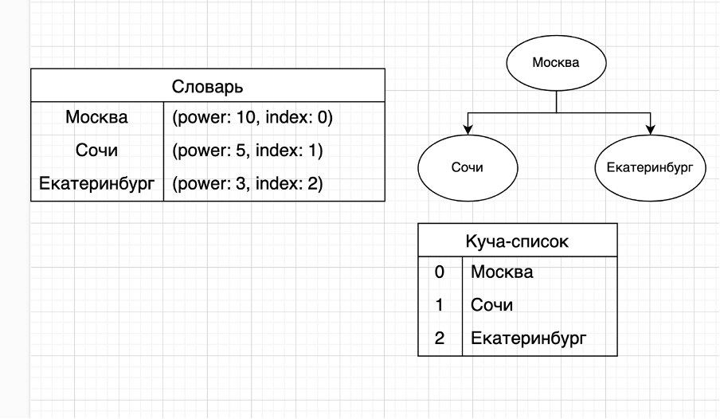

# lab3

Условия задач и описание решений

## [Задача 2. Миллиардеры](./src/tasks/task2.rs)

*Ограничение времени: 3 с. Ограничение памяти: 64 Mb.*

Возможно, вы знаете, что из всех городов мира больше всего миллиардеров живёт в Москве. Но, поскольку работа миллиардера подразумевает частые перемещения по всему свету, в определённые дни какой-то другой город может занимать первую строчку в таком рейтинге. Ваши приятели из ФСБ, ФБР, MI5 и Шин Бет скинули вам списки перемещений всех миллиардеров за последнее время. Ваш работодатель просит посчитать, сколько дней в течение этого периода каждый из городов мира был первым по общей сумме денег миллиардеров, находящихся в нём.

### Формат входных данных

В первой строке записано число *n* — количество миллиардеров (1 ≤ *n* ≤ 10000). Каждая из следующих *n* строк содержит данные на определённого человека: его имя, название города, где он находился в первый день данного периода, и размер состояния. В следующей строке записаны два числа: *m* — количество дней, о которых есть данные (1≤ *m* ≤ 50000), *k* — количество зарегистрированных перемещений миллиардеров (0 ≤ *k* ≤ 50000). Следующие *k* строк содержат список перемещений в формате: номер дня (от 1 до *m* − 1), имя человека, название города назначения. Вы можете считать, что миллиардеры путешествуют не чаще одного раза в день, и что они отбывают поздно вечером и прибывают в город назначения рано утром следующего дня. Список упорядочен по возрастанию номера дня. Все имена и названия городов состоят не более чем из 20 латинских букв, регистр букв имеет значение. Состояния миллиардеров лежат в пределах от 1 до 100 миллиардов.

### Формат выходных данных

В каждой строке должно содержаться название города и, через пробел, количество дней, в течение которых этот город лидировал по общему состоянию миллиардеров, находящихся в нём. Если таких дней не было, пропустите этот город. Города должны быть отсортированы по алфавиту (используйте обычный порядок символов: ABC...Zabc...z).

### Описание решения

Для решения этой задачи использовал создал структуру [`HashMaxHeap`](./src/modules/hash_max_heap.rs), объединяющую под капотом словарь и MaxHeap. Чтобы вставить элемент мы принимаем ключ и его мощность `insert(key, power)`. Ключ помещается в кучу, происходит перебалансировка. В словарь попадает ключ, его мощность и индекс, по которому был расположен элемент в куче(см. рисунок ниже). При балансировке индексы расположения элементов в куче так же обновляются и в словаре. Куча построена на основе списка, новые элементы всегда добавляются в конец. Добавил метод для изменения мощности элемента `change(key, get_new_power)`, который принимает ключ и лямбду, которая в свою очередь принимает старый ключ и возвращает новый, который записывается в словарь, и происходит балансировка.

#### Алгоритм

1. Изначально записываем всех миллиардеров и города в виде словарей, где ключи – строки имена, названия городов, а значения – богатство. Так можно быстро обращаться к определенному городу, изменять его денежное состояние.
2. После окончания ввода данных (формирования всех словарей) добавляем города и их состояния в словарь-кучу.
3. Запускаем цикл for по всем переездам(movement), если день переезда больше, чем предыдущий сохраненный, смотрим в словарь-куче самый мощный элемент (который будет находиться на первом месте), отмечаем его в результирующем словаре.

   В movement указано, что миллиардер переезжает, тогда мы меняем в словарь-куче мощности соответствующих городов.

4. В конце смотрим: если последний сохраненный день не равен количеству дней, добавляем запись о первом элементе кучи в результирующий словарь.

   Делаем из него массив, сортируем его по названию города и возвращаем.



## [Задача 3. Пирамидальная сортировка](./src/tasks/task3.rs)

*Ограничение по времени – 1.5 с. Ограничение по памяти – 256 Mb.*

В данной задаче необходимо реализовать сортировку кучей. При этом кучу необходимо реализовать самостоятельно, использовать имеющиеся в языке реализации нельзя. Сначала рекомендуется решить задачи про просеивание вниз и вверх.

Тимофей решил организовать соревнование по спортивному программированию, чтобы найти талантливых стажёров. Задачи подобраны, участники зарегистрированы, тесты написаны. Осталось придумать, как в конце соревнования будет определяться победитель.

Каждый участник имеет уникальный логин. Когда соревнование закончится, к нему будут привязаны два показателя: количество решённых задач 𝑃𝑖 и размер штрафа 𝐹𝑖. Штраф начисляется за неудачные попытки и время, затраченное на задачу.

Тимофей решил сортировать таблицу результатов следующим образом: при сравнении двух участников выше будет идти тот, у которого решено больше задач. При равенстве числа решённых задач первым идёт участник с меньшим штрафом. Если же и штрафы совпадают, то первым будет тот, у которого логин идёт раньше в алфавитном (лексикографическом) порядке.

Тимофей заказал толстовки для победителей и накануне поехал за ними в магазин. В своё отсутствие он поручил вам реализовать алгоритм сортировки кучей (англ. Heapsort) для таблицы результатов.

### Формат входных данных

В первой строке задано число участников 𝑛, 𝑙 ≤ 𝑛 ≤ 100000.

В каждой из следующих и строк задана информация про одного из участников.

𝑖 -й участник описывается тремя параметрами:

* уникальным логином (строкой из маленьких латинских букв длиной не более 20)
* числом решенных задач 𝑃𝑖
* Штрафом 𝐹𝑖

𝐹𝑖 и 𝑃𝑖 - целые числа, лежащие в диапазоне от 0 до 109.

### Формат выходных данных

Для отсортированного списка участников выведите по порядку их логины по одному в строке.

### Примеры

| Стандартный ввод                                                          | Стандартный вывод                        |
| ------------------------------------------------------------------------- | ---------------------------------------- |
| 5<br>alla 4 100<br>gena 6 1000<br>gosha 2 90<br>rita 2 90<br>timofey 4 80 | gena<br>timofey<br>alla<br>gosha<br>rita |
| 5<br>alla 0 0<br>gena 0 0<br>gosha 0 0<br>rita 0 0<br>timofey 0 0         | alla<br>gena<br>gosha<br>rita<br>timofey |

### Описание решения

Для сортировки с помощью [heap_sort](./src/modules/heap_sort.rs) нужно сперва упорядочить переданный массив как кучу, наиболее приоритетные элементы в начале, левый и правый потомки в 2i + 1 и 2i + 2. Так как потомки расположены через 2i, то мы запускаем heapify из середины массива, heapify сравнивает три элемента: родителя и два потомка, если упорядоченность не соблюдается, устанавливается наибольший из них на место родителя (так происходит создание кучи) и повторяем процедуру рекурсивно для потомка, которого мы только что переставили, чтобы прокинуть его вниз по куче, если там находятся элементы более приоритетные.

Куча готова, теперь запускаем for i от конца массива до начала. Меняем местами первый (самый приоритетный) элемент и элемент i. Самые приоритетные элементы будут накапливаться в конце массива. Куча стала снова не упорядочена, запускаем heapify, но длину массива уменьшаем до i не включительно, чтобы не нарушить порядок уже полученных самых приоритетных элементов. Доходим до начала, массив отсортирован.

## [Задача 5. Куча ли?](./src/tasks/task5.rs)

Структуру данных «куча», или, более конкретно, «неубывающая пирамида», можно реализовать на основе массива. Для этого должно выполняться основное свойство неубывающей пирамиды, которое заключается в том, что для каждого 1≤i≤n выполняются условия:

* если 2i≤n, то a[i]≤a[2i];
* если 2i+1≤n, то a[i]≤a[2i+1].

Дан массив целых чисел. Определите, является ли он неубывающей пирамидой.

### Формат входных данных

Первая строка входного файла содержит целое число n (1≤n≤106). Вторая строка содержит n целых чисел, по модулю не превосходящих 2⋅109.

### Формат выходных данных

Выведите «YES», если массив является неубывающей пирамидой, и «NO» в противном случае.

### Описание решения

Идем по элементам от начала до конца. Для каждого проверяем, что его левый и правый потомки 2i+1 и 2i+2 не превышают родителя. Если все условия выполняются, значит перед нами куча, выводим YES, иначе NO.

## [Задача 7. Постфиксная запись](./src/tasks/task7.rs)

В постфиксной записи (или обратной польской записи) операция записывается после двух операндов. Например, сумма двух чисел A и B записывается как A B +. Запись B C + D ∗ обозначает привычное нам (B + C) ∗ D, а запись A B C + D ∗ + означает A + (B + C) ∗ D. Достоинство постфиксной записи в том, что она не требует скобок и дополнительных соглашений о приоритете операторов для своего чтения.

Дано выражение в обратной польской записи. Определите его значение.

### Формат входных данных

В первой строке входного файла дано число N (1≤N≤106) - число элементов выражения. Во второй строке содержится выражение в постфиксной записи, состоящее из N элементов. В выражении могут содержаться неотрицательные однозначные числа и операции +, −, ∗. Каждые два соседних элемента выражения разделены ровно одним пробелом.

### Формат выходных данных

Необходимо вывести значение записанного выражения. Гарантируется, что результат выражения, а также результаты всех промежуточных вычислений, по модулю будут меньше, чем 231.

### Описание решения

Проходим по символам: если это цифра, помещаем в стек, если оператор, достаем две цифры из стека, проводим операцию, результат записываем обратно в стек. После окончания прохода извлекаем из стека результат и выводим.

## [Задача 10. Вложенные отрезки](./src/tasks/task10.rs)

*Ограничение времени: 1 секунда. Ограничение памяти: 64 МБ.*

На прямой лежат *n* отрезков. Для каждой пары отрезков известно, что они либо не имеют общих точек, либо все точки одного из них также принадлежат и другому отрезку.

Дано *m* запросов. Каждый запрос представляет собой точку на прямой. Найдите для каждого запроса отрезок минимальной длины, которому принадлежит эта точка.

### Формат входных данных

В первой строке записано целое число *n* — количество отрезков (1 ≤ *n* ≤ 105). *i*-я из следующих *n* строк содержит целые числа *ai* и *bi* — координаты концов *i*-го отрезка (1≤ *ai* < *bi* ≤ 109). Отрезки упорядочены по неубыванию *ai*, а при *ai* = *aj* — по убыванию длины. Совпадающих отрезков нет. В следующей строке записано целое число *m* — количество запросов (1 ≤ *m* ≤ 105). В *j*-й из следующих *m* строк записано целое число *cj* — координата точки (1 ≤ *cj* ≤ 109). Запросы упорядочены по неубыванию *cj*.

### Формат выходных данных

Для каждого запроса выведите номер искомого отрезка в отдельной строке. Если точка не принадлежит ни одному отрезку, выведите «-1». Отрезки пронумерованы числами от 1 до *n* в том порядке, в котором они перечислены во входных данных.

### Решение

Для каждого запроса с помощью бинарного поиска(find_nearest_right_bound) находим ближайший правый отрезок, с левой координатой большей чем сам запрос. Начинаем идти от его индекса до 0(включительно), проверяя есть ли подходящий для нас отрезок (включающий запрос), если мы его нашли записываем в результат его индекс, иначе -1.

## Автотесты

```
cd lab3
cargo test
```

Можно запустить:

* `task2`
* `hash_max_heap`
* `task3`
* `heap_sort`
* `task5`
* `task7`
* `task10`

## [Бенчмарки](./benches/benchmarks.rs)

```
cd lab3
cargo bench
```

Можно запустить:

* `task10`
