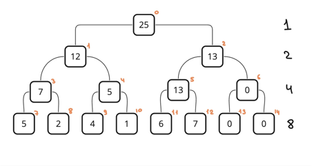

# lab4

Условия задач и описание решений

## [Задача 2. Брокеры](./src/tasks/task2.rs)

*Ограничение по времени: 1 секунда. Ограничение по памяти: 64 мегабайта*

В стране Бурляндии фирма «Котлетный рай» имеет много отделений, работающих сравнительно автономно. После неких экономических преобразований такая форма функционирования оказалась невыгодной и фирма решила сливать капиталы отделений, образуя укрупненные департаменты, отвечающие за несколько отделений сразу. Цель фирмы – слить все отделения в один громадный департамент, владеющий всеми капиталами. Проблема заключается в том, что по законам Бурляндии операция слияния капиталов должна проводиться государственной брокерской службой, которая не может производить более одной операции слияния в одной фирме одновременно. Вторая проблема состоит в том, что брокерская служба берет за свои услуги один процент всех средств, получившихся в результате слияния двух подразделений. Важно спланировать порядок операций слияния таким образом, чтобы фирма потратила на слияние как можно меньшую сумму.

### Формат входных данных

На вход программы подается число отделение 2 ≤ N ≤ 1000000, за которым следует N капиталов отделений 1 ≤ Ci ≤ 1000000.

### Формат выходных данных

T – минимальная сумма из возможных, которую должна заплатить брокерам фирма

«Котлетный рай», с двумя знаками после запятой.

### Примеры

| Стандартный ввод                                            | Стандартный вывод |
| ----------------------------------------------------------- | ----------------- |
| 5<br>1<br>2<br>3<br>4<br>5                                  | 0.33              |
| 10<br>2<br>10<br>100<br>30<br>7<br>4<br>15<br>2<br>15<br>80 | 6.52              |

### Описание решения

Заплатить наименьшую комиссию можно в том случае, сливать отделения с самыми малыми капиталами.

Используем [минимальную кучу](./src/modules/heap.rs), положим в нее все введенные числа. Запустим цикл while heap.len() > 1, на каждой итерации будем доставать два наименьших капитала, складывать их, считать комиссию и класть обратно в кучу.

После окончания цикла в куче останется один элемент. Достаем его, округляем до 2-х цифр после запятой.

## [Задача 3. Пересечение множеств](./src/tasks/task3.rs)

*Ограничение по времени: 2 секунды. Ограничение по памяти: 64 мегабайта*

Задано 2 ≤ N ≤ 1000 множеств из 3 ≤ M ≤ элементов, значения которых могут находиться в диапазоне от -2000000000 до 2000000000. Значения каждого множества задаются в произвольном порядке. Гарантируется, что для одного множества все задаваемые значения различные.

Требуется найти наибольший размер множества, получаемого при пересечении какой-либо из пар из заданных множеств.

### Формат входных данных

```
N M
A_1[1] A_1[2] … A_1[M]
A_2[1] A_2[2] … A_2[M]
…
A_N[1] A_N[2] … A_N[M]
```

### Формат выходных данных

Одно целое число

### Примеры

| Стандартный ввод                                                 | Стандартный вывод |
| ---------------------------------------------------------------- | ----------------- |
| 3 4<br>9 7 1 8<br>5 7 6 3<br>5 9 8 6                             | 2                 |
| 4 5<br>-2 6 8 4 -1<br>5 3 10 -5 -1<br>7 8 -5 -1 -2<br>-1 8 4 9 0 | 3                 |

### Описание решения

Каждое множество представляем в виде HashSet. Проходим по всем возможным парам множеств, находим наибольший размер пересечения.

## [Задача 5. Ксерокопии](./src/tasks/task5.rs)

*Ограничение по времени: 0,2 секунды. Ограничение по памяти: 16 мегабайт*

Секретарша Людочка сегодня опоздала на работу и ей срочно нужно успеть к обеду сделать N копий одного документа. В ее распоряжении имеются два ксерокса, один из которых копирует лист за х секунд, а другой – за y секунд. (Разрешается использовать как один ксерокс, так и оба одновременно. Можно копировать не только с оригинала, но и с копии.) Помогите ей выяснить, какое минимальное время для этого потребуется.

### Формат входных данных

Во входном файле INPUT.TXT записаны три натуральных числа N, x и y, разделенные пробелом (1 ≤ N ≤ 2∙108, 1 ≤ x, y ≤ 10).

### Формат выходных данных

В выходной файл OUTPUT.TXT выведите одно число – минимальное время в секундах, необходимое для получения N копий.

### Пример

| INPUT.TXT | OUTPUT.TXT |
| --------- | ---------- |
| 4 1 1     | 3          |
| 5 1 2     | 4          |

### Описание решения

Из двух ксероксов определим который быстрый, который медленный. Сперва на быстром делаем первую копию, после этого можно будет копировать, используя два устройства.

Для нахождения оптимального соотношения распределения количества копий между ксероксами, необходимо чтобы, общее время работы быстрого и медленного прибора были равны.

Воспользуемся бинарным поиском: левую границу укажем `0`, правую – `количество копий / 2`. На итерации бин поиска вычисляем среднее значение значение, находим время работы ксероксов как `max(копии_для_быстрого * скорость_быстрого, копии_для_медленного * скорость_медленного)`, сравниваем с наилучшим временем, затем выбираем направление поиска. Если время работы быстрого ксерокса больше времени работы медленного, нужно передать часть работы медленному прибору, установим левую границу в `(left + right) / 2`.

## [Задача 7. Запросы сумм](./src/tasks/task7.rs)

*Ограничение по времени: 2 секунды. Ограничение по памяти: 64 мегабайта*

В первой строке файла содержатся два числа: количество элементов в массиве V: 10 ≤ N ≤ 500000 и количество запросов 1 ≤ M ≤ 500000. Каждый элемент массива лежит в интервале [0…232).

Каждый запрос – отдельная строка, состоящая из кода запроса, который может быть равен 1 или 2 и аргументов запроса.

Запрос с кодом один содержит два аргумента, начало L и конец отрезка R массива. В ответ на этот запрос программа должна вывести значения суммы элементов массива от V[L] до V[R] включительно.

Запрос с кодом два содержит тоже два аргумента, первый из которых есть номер элемента массива V, а второй – его новое значение.

Количество выведенных строк должно совпадать с количеством запросов первого типа.

### Пример

| Стандартный ввод                                                                                                                    | Стандартный вывод          |
| ----------------------------------------------------------------------------------------------------------------------------------- | -------------------------- |
| 10 8<br>1<br>7<br>15<br>8<br>9<br>15<br>15<br>19<br>5<br>19<br>1 1 8<br>1 6 8<br>1 0 6<br>2 6 6<br>2 1 6<br>2 0 9<br>1 4 7<br>1 3 6 | 93<br>39<br>70<br>49<br>38 |

### Описание решения

Для решения задачи используем структуру [дерево отрезков](./src/modules/segtree_clone.rs). В листьях будут храниться исходные числа, а в родителях суммы(пример - рисунок ниже). Хранить будем его в массиве размера 2n, листья будут находиться во второй половине массива. Для обновления элемента, изменяем лист, поднимемся по родителю и обновим его значение.

Для подсчета суммы берем в границы индексы листьев левый и правый. Запускаем цикл `while left < right`, в котором будем подниматься от листьев к родителям и считать суммы. Для левой границы: если индекс нечетный, можно прибавить к результату его родителя, если четный – подниматься по родителю нельзя, надо прибавлять к результату сам элемент и сместить индекс на единицу вправо, затем уже можно подниматься по родителю. Для правой границы почти так же.

Итак, строим дерево отрезков из входных чисел, в качестве узлов используем [BigInt из lab1](../lab1/src/modules/big_int.rs) и `num_bigint::BigUint`(в бенчмарках я сравнил скорость решения двумя типами). Проходим по запросам циклом for и выполняем их.



## [Задача 10. Анаграммы](./src/tasks/task10.rs)

*Ограничение по времени: 0.5 секунд. Ограничение по памяти: 256 мегабайт*

Как известно, анаграммами называются слова, которые могут получиться друг из друга путем перестановки букв, например LOOP, POOL, POLO. Будем называть все слова такого рода *комплектом*.

На вход программы подается число слов 1 ≤ N ≤ 100000. В каждой из очередных N строк присутствует одно слово, состоящее из заглавных букв латинского алфавита. Все слова имеют одинаковую длину 3 ≤ L ≤ 10000.

Требуется определить число комплектов во входном множестве.

### Формат входных данных

```
N
W1
W2
…
WN
```

### Формат выходных данных

NumberOfComplects

### Примеры

|                                     |                   |
| ----------------------------------- | ----------------- |
| Стандартный ввод                    | Стандартный вывод |
| 8  BCB ABA BCB BAA BBC CCB CBC  CBC | 3                 |

### Описание решения

Будем идти по массиву строк циклом for. Из каждой строки делаем массив `[0u16, 26]` – для 26 букв английского алфавита, значение каждой ячейки\[i] будет обозначать частоту появления буквы. Для этого пройдемся по символам строки циклом for, из номера символа будем вычитать номер `A`, получая индекс буквы i, увеличивая значение по нему на единицу. Полученный массив запишем в HashSet, в результате получатся только массивы с уникальным набором букв. Вернем количество записей в HashSet.

## Автотесты

```
cd lab4
cargo test
```

Можно запустить:

* `task2`
* `heap`
* `task3`
* `task5`
* `task7`
* `segtree_copy`
* `segtree_clone`
* `task10`

## [Бенчмарки](./benches/benchmarks.rs)

```
cd lab4
cargo bench
```

Можно запустить:

* `task2`
* `task3`
* `task5`
* `task7` - сравнение скорости моих [BigIng](../lab1/src/modules/big_int.rs) и num_bigint::BigUint
* `task10`