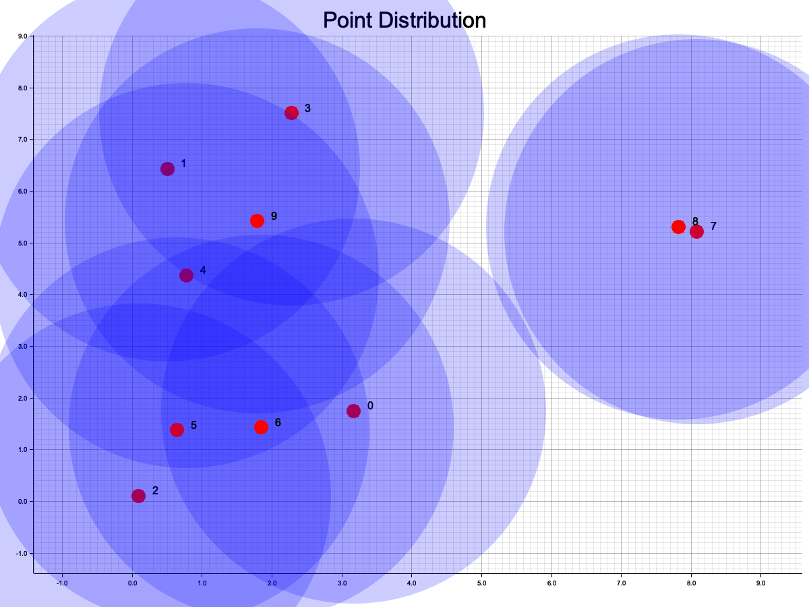
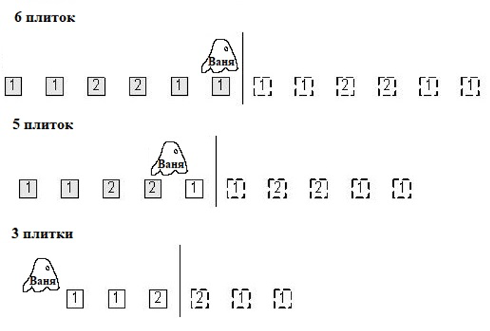

# lab5

Условия задач и описание решений

## [Задача 2. Большая книжка](./src/tasks/task2.rs)

*Ограничение по времени: 5 секунды. Ограничение по памяти: 4 мегабайта*

Заказчику понравилось решение нашей задачи по созданию записной книжки и он предложил нам более сложную задачу: создать простую базу данных, которая хранит много записей вида ключ: значение. Для работы с книжкой предусмотрены 4 команды:

ADD KEY VALUE — добавить в базу запись с ключом KEY и значением VALUE. Если такая запись уже есть, вывести ERROR.

DELETE KEY — удалить из базы данных запись с ключом KEY. Если такой записи нет — вывести ERROR.

UPDATE KEY VALUE — заменить в записи с ключом KEY значение на VALUE. Если такой записи нет — вывести ERROR.

PRINT KEY — вывести ключ записи и значение через пробел. Если такой записи нет — вывести ERROR.

Количество входных строк в файле с данными не превышает 300000, количество первоначальных записей равно половине количества строк (первые N/2 команд есть команды ADD).

Длины ключей и данных не превосходят 4096. Ключи и данные содержат только буквы латинского алфавита и цифры и не содержат пробелов.

Особенность задачи: все данные не поместятся в оперативной памяти и поэтому придется использовать внешнюю.

### Примеры

| Стандартный ввод                                                                                                                                                                                                                                                    | Стандартный вывод                                      |
| ------------------------------------------------------------------------------------------------------------------------------------------------------------------------------------------------------------------------------------------------------------------- | ------------------------------------------------------ |
| 8<br>ADD JW SJXO<br>ADD RZBR YMW<br>ADD ADX LVT<br>ADD LKFLG UWM<br>PRINT ADX<br>UPDATE HNTP JQPVG<br>PRINT QURWB<br>DELETE MB                                                                                                                                      | ADX LVT<br>ERROR<br>QURWB MEGW<br>ERROR                |
| 15<br>ADD RWJSN JFTF<br>ADD ZDH GOON<br>ADD FCDS TCAY<br>ADD FCDS TCAY<br>ADD HMGVI BWK<br>ADD JTDU TLWWN<br>ADD IXRJ ERF<br>ADD IAOD GRDO<br>PRINT IXRJ<br>PRINT JTDU<br>PRINT IXRJ<br>UPDATE ZDH IOX<br>PRINT ZDH<br>ADD GVWU RTA<br>DELETE ZDH<br>ADD FCDS IVFJV | IXRJ ERF<br>JTDU TLWWN<br>IXRJ ERF<br>ZDH IOX<br>ERROR |

### Описание решения

Создаем [базу данных](./src/modules/hash_database.rs) – она хранит файл во внешней памяти, свой размер, и массив адресов, по которым расположены записи в файле.

При добавлении записи мы считаем хэш ключа и получаем индекс для массива адресов. Проверяем что записи с таким ключом не существует. В конец файла добавляем новую запись, которая содержит: идентификатор удалена/не удалена (1 байт), адрес next следующей записи в связанном списке (8 байт), длину ключа (2 байта) и длину значения (2 байта), ключ и значение. Если в данной ячейке уже есть запись (произошла коллизия) мы записываем ее адрес к себе в поле next, а свой адрес кладем в массив адресов по индексу ячейки.

Для удаление/обновление мы считаем хэш, получаем индекс. В массиве находим адрес для файла, запускаем while для прохода по связанному списку из записей, находим ту у которой совпадает ключ с нашим, помечаем ее как deleted, делаем новую запись с обновленными значениями.

## [Задача 3. Сопоставление по образцу](./src/tasks/task3.rs)

*Ограничение по времени: 2 секунды. Ограничение по памяти: 64 мегабайта*

Известно, что при работе с файлами можно указывать метасимволы \* и ? для отбора нужной группы файлов, причем знак \* соответствует любому множеству, даже пустому, в имени файла, а символ ? Соответствует ровно одному символу в имени.

Первая строка программы содержит имя файла, состоящее только из заглавных букв латинского языка (A-Z), а вторая — образец, содержащий только заглавные буквы латинского алфавита и, возможно, символы \* и ?. Строки не превышают по длине 700 символов. Требуется вывести слова YES или NO в зависимости от того, сопоставляется ли имя файла указанному образцу.

### Формат входных данных

```
SOMETEXT
PATTERN
```

### Формат входных данных

`YES` или `NO`

### Примеры

|                         |                   |
| ----------------------- | ----------------- |
| Стандартный ввод        | Стандартный вывод |
| ABRACADABRA  ABRA\*ABRA | YES               |
| FOOBAR  F??B??          | YES               |
| FOOBAR  F\*??O\*        | NO                |

### Описание решения

Рекурсивно запускаем функцию от input и pattern:

* Если обе строки пусты, возвращаем true
* Если input не пуст, паттерн состоит из символов \*, возвращаем true
* Если input пуст, паттерн нет, возвращаем false
* Иначе берем первые символы и срезы, не включающие их с обоих строк:
  + Если символ паттерна ? продолжаем рекурсию со срезами
  + Если \* то запускаем рекурсию с включенным символом и без него
  + Иначе сравниваем символы паттерна и input на равенство, в зависимости от этого возвращаем false, или продолжаем рекурсию.

## [Задача 5. Такси](./src/tasks/task5.rs)

*Ограничение по времени: 2 секунды. Ограничение по памяти: 32 мегабайта*

В некотором очень большом городе руководство осознало, что в автономные такси, то есть, такси без водителя — большое благо и решило открыть 10 станций по аренде таких такси. Были получены данные о том, откуда клиенты могут заказывать машины. Было замечено, что если станция находится от клиента на расстоянии, не большем, чем некое число R, то клиент будет арендовать машину именно на этой станции, причем, если таких станций несколько — клиент может выбрать любую. Для экономии, станции решено строить только в местах возможного расположения клиентов. Задача заключается в том, чтобы определить места наилучшей постройки, то есть такие, которые могут обслужить наибольшее количество клиентов.

### Формат входных данных

В первой строке входного файла — два числа, количество клиентов и значение параметра R. В каждом из последующих N — два числа, координаты Xi и Yi  i-го клиента (нумерация ведется с нуля).

### Формат входных данных

В выходном файле должно присутствовать не более 10 строк. Каждая строка должна содержать номер клиента, у которого выгоднее всего строить станцию, и количество обслуживаемых этой станцией клиентов, отличное от нуля. Выводимые строки должны быть упорядочены от наибольшего количества обслуживаемых клиентов к наименьшему. Если две и более станции могут обслужить одинаковое количество клиентов, то выше в списке должна находиться станция с меньшим номером.

### Примеры

| Стандартный ввод                                                                                                                                                                                                              | Стандартный вывод                                                  |
| ----------------------------------------------------------------------------------------------------------------------------------------------------------------------------------------------------------------------------- | ------------------------------------------------------------------ |
| 5 3<br>0 0<br>2 -2<br>5 1                                                                                                                                                                                                     | 0 2<br>1 1<br>2 1<br>3 1<br>4 1                                    |
| 10 3.000000<br>3.168070 1.752490<br>0.500730 6.436580<br>0.089300 0.112720<br>2.275440 7.508780<br>0.779230 4.377090<br>0.644400 1.381650<br>1.844920 1.430420<br>8.079870 5.225030<br>7.823270 5.317290<br>1.788400 5.426120 | 5 4<br>1 3<br>4 3<br>6 3<br>9 3<br>0 2<br>2 2<br>3 2<br>7 1<br>8 1 |

### Описание решения

Запускаем for по всем точкам, внутри запускаем еще один for. Вычисляем дистанцию между двумя точками, если она меньше радиуса увеличиваем число соседей. Работаем за O($N^{2}$).

### Дополнительно

Для одного теста я сделал [скрипт](./src/tasks/task5/plots.rs), рисующий [график](./src/tasks/task5/points.png):



## [Задача 7. Хеш-таблица](./src/tasks/task7.rs)

*Ограничение по времени: 5 секунд (Python – 15 секунд). Ограничение по памяти: 64 мегабайта*

Тимофей, как хороший руководитель, хранит информацию о зарплатах своих сотрудников в базе данных и постоянно её обновляет. Он поручил вам написать реализацию хеш-таблицы, чтобы хранить в ней базу данных с зарплатами сотрудников.

Хеш-таблица должна поддерживать следующие операции:

* put key value – добавление пары ключ-значение. Если заданный ключ уже есть в таблице, то соответствующее ему значение обновляется.
* get key – получение значения по ключу. Если ключа нет в таблице, то вывести «None». Иначе вывести найденное значение.
* delete key – удаление ключа из таблицы. Если такого ключа нет, то вывести «None», иначе вывести хранимое по данному ключу значение и удалить ключ.

В таблице хранятся уникальные ключи.

Требования к реализации:

* Нельзя использовать имеющиеся в языках программирования реализации хеш-таблиц (std::unordered\_map в C++, dict в Python, HashMap в Java, и т. д.)
* Число хранимых в таблице ключей не превосходит 105.
* Разрешать коллизии следует с помощью метода цепочек или с помощью открытой адресации.
* Все операции должны выполняться за O(1) в среднем.
* Поддерживать рехеширование и масштабирование хеш-таблицы не требуется.
* Ключи и значения, id сотрудников и их зарплата, – целые числа. Поддерживать произвольные хешируемые типы не требуется.

### Формат ввода

В первой строке задано общее число запросов к таблице *n* $(1\leq n \leq 10^{6})$.

В следующих *n* строках записаны запросы, которые бывают трех видов – get, put, delete – как описано в условии.

Все ключи и значения – целые неотрицательные числа, не превосходящие 109.

### Формат вывода

На каждый запрос вида get и delete выведите ответ на него в отдельной строке.

### Пример

| Ввод                                                                                                      | Вывод                                     |
| --------------------------------------------------------------------------------------------------------- | ----------------------------------------- |
| 10<br>get 1<br>put 1 10<br>put 2 4<br>get 1<br>get 2<br>delete 2<br>get 2<br>put 1 5<br>get 1<br>delete 2 | None<br>10<br>4<br>4<br>None<br>5<br>None |
| 8<br>get 9<br>delete 9<br>put 9 1<br>get 9<br>put 9 2<br>get 9<br>put 9 3<br>get 9                        | None<br>None<br>1<br>2<br>3               |

### Описание решения

В каждой ячейке нашего словаря будем использовать встроенную в язык двунаправленную очередь VecDeque, потому что она довольно быстрая, а проектировать собственный двухсвязный список непростая задача из-за системы владения.

Для вставки, получения, удаления считаем хэш ключа, получаем индекс ячейки. Смотрим если в ней лежит VecDeque, то запускаем по нему for, находим нужный ключ со значением, меняем, получаем или удаляем их.

## [Задача 10. Привидение Ваня](./src/tasks/task10.rs)

*Ограничение по времени: 2 секунды. Ограничение по памяти: 64 мегабайта*

Привидение Ваня любит играть со своими плитками. Он любит выкладывать их в ряд и разглядывать свое творение. Однако недавно друзья решили подшутить над Ваней и поставили в его игровой комнате зеркало. Ведь всем известно, что привидения не отражаются в зеркале! А плитки отражаются. Теперь Ваня видит перед собой N цветных плиток, но не знает, какие из этих плиток настоящие, а какие — всего лишь отражение в зеркале. Помогите Ване! Выясните, сколько плиток может быть у Вани. Ваня видит отражение всех плиток в зеркале и часть плиток, которая находится перед ним. Часть плиток может быть позади Вани, их он не видит.



### Описание входных данных

Первая строка входного файла содержит число N (1⩽ N ⩽106) и количество различных цветов, в которые могут быть раскрашены плитки — M (1⩽M⩽106). Следующая строка содержит N целых чисел от 1 до M — цвета плиток

### Описание выходных данных

Выведите в выходной файл все такие K, что у Вани может быть K плиток в порядке убывания.

### Описание решения

Используем полиномиальные хэши для сравнения последовательностей. Он будет считаться по формуле $hash=s\_{0}+s\_{1}p+s\_{2}p^{2}+…+s\_{n}p^{n}$ , где s – плитка, p – взаимно простое число с 2^64(доказывается математически), мы используем u64.

Зразу же посчитаем нужные степени числа p, запустив цикл for, на каждом шаге умножая предыдущее значение на p. Запустим цикл for: найдем хэши прямых и инвертированный подпоследовательностей.

Начнем подсчет возможного количества плиток.

1. Если приведение стоит прямо перед зеркалом – оно видит все плитки в отражении, значит однозначно возможно, что у него может быть количество плиток равное количеству введенных значений.
2. Зеркало не может стоять дальше середины последовательности, иначе количество отражающихся плиток было бы меньше, чем их есть в действительности. Поэтому запустим цикл for i от 0 до n/2.
3. Будем рассматривать последовательности от 0 до i и инвертированные последовательности, с началом в i+1 и концом в 2\*i+1.
4. Берем прямой хэш по индексу hash[i], его нужно сравнить с обратным хэшем по индексу rev\_hash[i+1], но так как обратный хэш считается от конца строки до начала, то после индекса 2\*i+1 может находится продолжение последовательности, значит для сравнения подпоследовательностей нужно вычесть его из обратного хэша(или прибавить его к прямому). Так же прямой и обратный хэши отличаются разными степенями p, обратный хэш больше, чем прямой. Из-за переполнения u64, делить мы не можем, зато можем умножать, поэтому домножим прямой хэш на нужное значение p в степени.

## Автотесты

```
cd lab5
cargo test
```

Можно запустить:

* `task2`
* `cargo test hash_database -- --include-ignored` - эти тесты помечены как ignored, поэтому нужен дополнительный флаг
* `task3`
* `task5`
* `dictionary`
* `task10`

## [Бенчмарки](./benches/benchmarks.rs)

```
cd lab5
cargo bench
```

Можно запустить:

* `task5`
* `dictionary`