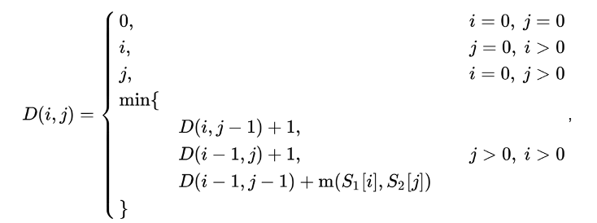
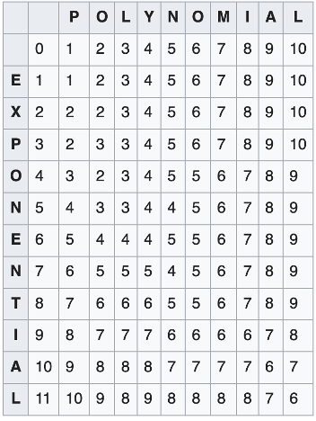

# lab6

Условия задач и описание решений

## [Задача 2. Маршрутка](./src/tasks/task2.rs)

*Ограничение по времени: 1 секунда. Ограничение по памяти: 64 мегабайта*

### Вступление

Водитель маршрутки Сергей Александрович Жадных прославился своей феноменальной жадностью повсеместно. Он сам неоднократно заявлял, что за лишнюю копейку готов задушить родного брата и продать всех друзей. К сожалению, проверить эти слова не представлялось возможным, поскольку никакого брата, а также друзей, дома и семьи у Сергея Александровича не было. И что ещё хуже, денег у него тоже не было. Единственным достоянием г-на Жадных являлась старая маршрутка, на которой он и колесил по городу, подвозя редких пассажиров и время от времени осматривая краем глаза тротуары в поисках мелких монет...

В один из дней небеса сжалились на Сергеем Александровичем и решили прекратить его бесполезное существование в этом жестоком мире. С сей благой целью на голову ничего не подозревавшего г-на Жадных, вышедшего из маршрутки на призывный блеск 5- рублёвой монеты, свалился топор. Мечты о выгодной продаже бутылки мигом вылетели у него из головы, поскольку их место занял топор. В переносном смысле этого слова. Орудие небес не смогло пробить окостеневший череп г-на Жадных, однако, как выяснилось позднее, придало ему несколько весьма полезных свойств.

Вскоре после продажи топора Сергей Александрович обнаружил, что способен предвидеть будущее. Какие возможности, какие перспективы открылись незадачливому водителю маршрутки! Кто мы такие и куда идём? Чего бояться и на что надеяться? Ответы на эти вопросы г-на Жадных совершенно не интересовали. А вот на то, чтобы с помощью новых умений попытаться заработать немного денег, выполняя привычную работу, сообразительности у Сергея Александровича хватило.

### Задача

Ежедневно маршрутка совершает один рейс от первой до N-й остановки. В маршрутке M мест для пассажиров. Вечером, просчитав линии вероятностей, г-н Жадных (между прочим, потенциальный Тёмный Иной шестого уровня) выяснил, что завтра на остановках маршрутку будут поджидать K человек. Для каждого человека были определены номер остановки S[i], на которой он желает сесть в маршрутку, и номер остановки F[i], на которой он собирается выйти. В соответствии с ценовой политикой Сергея Александровича, каждый пассажир должен заплатить P рублей за билет независимо от количества остановок. Более того, притормозив на остановке, г-н Жадных может выбирать, кого из желающих посадить в маршрутку, а кого нет. Ставя перед собой задачу максимизации прибыли, Сергей Александрович вполне разумно решил определить, каких именно людей нужно сажать в маршрутку. К сожалению, для этого его сил оказалось недостаточно. А Ваших?

### Формат входных данных

Первая строка содержит целые числа N (2 ≤ N ≤ 100000), M (1 ≤ M ≤ 1000), K (0≤K≤ 50000) и P (1 ≤ P ≤ 10000). Каждая из следующих K строк содержит целые числа S[i] и F[i] (1 ≤ S[i] < F[i] ≤ N) для соответствующего человека.

### Формат выходных данных

В первую строку вывести максимальную прибыль. Во вторую строку вывести через пробел и в любом порядке номера людей, которых следует сажать в маршрутку для получения этой прибыли. Если задача имеет несколько решений, то вывести любое из них.

### Примеры

| Стандартный ввод                                  | Стандартный вывод |
| ------------------------------------------------- | ----------------- |
| 6 2 6 9<br>1 4<br>2 6<br>1 5<br>2 3<br>4 6<br>3 6 | 36<br>1 5 6 4     |

### Описание решения

Сортируем всех пассажиров по времени выхода из маршрутки. Заведем очередь(маршрутку), пройдемся по отсортированному массиву через for. В очередь будем добавлять пассажиров если время выхода старых больше либо равно времени захода новых. При добавлении в очередь (или же в маршрутку) будем увеличивать прибыль и сохранять id пассажира.

## [Задача 3. Танец точек](./src/tasks/task3.rs)

*Ограничение по времени: 1 секунда. Ограничение по памяти: 256 мегабайт*

На прямой располагается 1 ≤ N ≤ 10000 точек с целочисленными координатами –109 ≤ Vi ≤ 109. Каждой из точек разрешается сделать ровно одно движение (танцевальное па) в любом направлении на расстояние не больше 0 ≤ L ≤ 108 и остановиться на другой позиции. Какое минимальное количество точек может остаться на прямой после окончания танца (все точки после танца, оказывающиеся на одной позиции, сливаются в одну)?

### Формат входных данных:

```
L N
V1 V2 … VN
```

### Формат выходных данных:

MinimalNumberOfPoints

### Примеры:

| Стандартный ввод      | Стандартный вывод |
| --------------------- | ----------------- |
| 10 5<br>30 3 14 19 21 | 2                 |

### Описание решения

1. Сортируем точки
2. Делаем проход всем точкам:
3. Проверяем, что (текущая точка + перемещение) меньше либо равно (следующая точка – перемещение)
   1. Если да, то точки можно слить в одну
   2. Иначе делаем точку текущей и начинаем рассматривать другие относительно ее.

## [Задача 5. Периодическая дробь.](./src/tasks/task5.rs)

*Ограничение по времени: 1 секунда. Ограничение по памяти: 256 мегабайт*

Выведите десятичное представление рациональной правильной дроби. Если в представлении присутствует период, то нужно вывести первое его вхождение в круглых скобках.

### Формат входных данных

Два целых числа, введенных через пробел: 1≤N<M≤150000000

### Формат выходных данных

Десятичное представление числа N/M

### Примеры

| Стандартный ввод | Стандартный вывод |
| ---------------- | ----------------- |
| 6 70             | 0.0(857142)       |
| 17 250           | 0.068             |

### Описание решения

Делим числитель на знаменатель пока остаток не будет равен нулю, либо пока он не попадется нам второй раз, попутно записывая целые части от деления в список.

Если остаток попался второй раз значит все последующие цифры будут идентичны, тем что уже встречались, после его первого появления, поэтому будем вести таблицу остатков с индексами их появления.

Выводим результат форматируя его в зависимости от условия завершения цикла.

## [Задача 7. Научная конференция](./src/tasks/task7.rs)

*Ограничение по времени: 1 секунда. Ограничение по памяти: 64 мегабайта*

Работа научной конференции обычно разделена на несколько одновременно проходящих секций. Например, может быть секция параллельных вычислений, секция визуализации, секция сжатия данных и так далее.

Очевидно, одновременная работа нескольких секций необходима, чтобы уменьшить время научной программы конференции и иметь больше времени на банкет, чаепитие и неофициальные обсуждения. Однако интересные доклады могут проходить одновременно в разных секциях.

Участник записал расписание всех докладов, интересных ему. Он просит вас определить максимальное количество докладов, которые он сможет посетить.

### Формат входных данных

Первая строка содержит количество 1 ≤ N ≤ 100 000 интересных докладов. Каждая из следующих N строк содержит два целых числа Ts и Te, разделённых пробелом (1 ≤ Ts < Te ≤ 30 000). Эти числа — время начала и конца соответствующего доклада. Время задано в минутах от начала конференции.

### Формат выходных данных

Выведите максимальное количество докладов, которые участник может посетить. Участник не может посетить два доклада, идущих одновременно, и любые два доклада, которые он посещает, должны быть разделены хотя бы одной минутой. Например, если доклад кончается в 15, следующий доклад, который может быть посещён, должен начинаться в 16 или позже.

### Примеры

| стандартный ввод                     | стандартный вывод |
| ------------------------------------ | ----------------- |
| 5<br>3 4<br>1 5<br>6 7<br>4 5<br>1 3 | 3                 |

### Описание решения

Сортируем по времени окончания доклада. Проходим по циклом: берем доклад в случае если текущий заканчивается раньше чем начинается новый.

## [Задача 10. Коррозия металла](./src/tasks/task10.rs)(НЕ РЕШЕНО)

*Ограничение по времени: 1 секунда. Ограничение по памяти: 16 мегабайт*

Для хранения двух агрессивных жидкостей A и B используется емкость с многослойной перегородкой, которая изготавливается из имеющихся N листов. Для каждого листа i (i = 1, …, N) известно время его растворения жидкостью A — ai и жидкостью B — bi. Растворение перегородки каждой из жидкостей происходит последовательно лист за листом, с постоянной скоростью по толщине листа.

Требуется написать программу проектирования такой перегородки, время растворения которой было бы максимальным.

### Формат входных данных

В первой строке входного файла INPUT.TXT записано число N (1 ≤ N ≤ 256). В каждой из последующих N строк содержатся два положительных вещественных числа ai и bi, разделенные пробелом (числа не превышают 106 и состоят не более чем из 11 значащих цифр).

### Формат выходных данных

В первую строку выходного файла OUTPUT.TXT записать время растворения перегородки с точностью, не меньшей 10-3. В следующую строку файла записать номера листов в порядке их расположения от жидкости A к жидкости B, разделяя числа пробелами.

### Примеры

| INPUT.TXT                           | OUTPUT.TXT       |
| ----------------------------------- | ---------------- |
| 4<br>1 2<br>1 2<br>0.5 1.5<br>7 3.5 | 6.000<br>4 2 1 3 |

### Описание решения

Отсортировать слои по некоторому критерию. Пройтись по списку в цикле, определяя слой в левую или правую часть.

### Проблема

При моем решении невозможно достичь того же результата что указан в примере: если сложить 2 + 2 + 1.5 получится 5.5, но никак не 6.000. Не понятно как на результат должен влиять самый левый слой (7, 3.5): он должен частично растаять тогда у него остается $\frac{5.5}{7}$ от прочности и его будет разъедают уже с двух сторон (потому что с правой стороны все листы закончатся). У меня в решении такое не учитывается

## [Задача 11. Расстояние по Левенштейну](./src/tasks/task11.rs)

*Ограничение по времени: 0.5 секунд (Python – 2.3 с.). Ограничение по памяти: 64 Mb*

Расстоянием Левенштейна между двумя строками *s* и *t* называется количества атомарных изменений, с помощью которых можно одну строку превратить в другую. Под атомарными изменениями подразумеваются: удаление одного символа, вставка одного символа, замена одного символа на другой.

Найди расстояние Левенштейна для предложенной пары строк. Выведите единственное число – расстояние между строками.

### Формат ввода данных

В первой строке дана строка *s*, во второй – строка *t*. Длины обеих строк не превосходит *1000*. Строки состоят из маленьких латинских букв.

### Примеры

| Стандартный ввод          | Стандартный вывод |
| ------------------------- | ----------------- |
| abacaba<br>abaabc         | 2                 |
| innokentiy<br>innokkentia | 3                 |
| r<br>x                    | 1                 |

### Описание решения

Воспользуемся следующей формулой:



Будем составлять таблицу, но понадобятся нам из нее только текущая и предыдущая строки, именно их и будем хранить в памяти(пример ниже). Первая строка и первый столбец сравнивают расстояние от пустой строки до нашей. Дальше запускаем два цикла (один вложенный) во внешнем начинаем смещаться по символам первой строки, во вложенном по второй. По формуле выше: выбираем минимальное значение из вставки/удаления символа, которые работают по горизонтали и вертикали и добавляют расстояние, замены, которая работает по диагонали и если символы совпадают не увеличивает расстояние.

Итоговым расстоянием между словами будет крайняя нижняя правая ячейка.



## [Задача 14. Путешествие продавца](./src/tasks/task14.rs)

*Ограничение по времени: 1 секунда. Ограничение по памяти: 64 мегабайта*

Как обычно, кому-то надо продать что-то во многих городах. Имеются города, представленные как *M* множеств (столбцов) по *N* городов (строк) в каждом.

Продавец должен посетить ровно по одному городу из каждого множества, затратив на это как можно меньшую сумму денег. Он должен посетить сначала город из первого множества, затем из второго и так далее, строго по порядку. Он может выбирать начало своего путешествия. Число, которое находится в i-й строке и j-м столбце означает стоимость перемещения из предыдущего места в этот город. Однако, имеется ограничение на перемещения: он может перемещаться из города в i-й строке только в города следующего столбца, находящиеся в одной из строк i -1, i, i+1, если такие строки существуют.

Иногда, чтобы заставить посетить продавца какой-то город, ему доплачивают, то есть, стоимость перемещения может быть отрицательной.

Требуется определить наименьшую стоимость маршрута и сам маршрут.

### Формат входных данных

```
N M
C11 C12 … C1M
C21 C22 … C2M
… … … …
CN1 CN2 … CNM
```

`3 ≤ N ≤ 150`, `3 ≤ M ≤ 1000`, `-1000 ≤ Cij ≤ 1000`

### Формат выходных данных

Первая строка — список через пробел номеров строк (начиная с 1) из M посещенных городов.

Вторая строка — общая стоимость поездки.

Если имеется несколько маршрутов с одной стоимостью, требуется вывести маршрут, наименьший в лексикографическом порядке.

Начинать и заканчивать маршрут можно в любой строке.

### Примеры

| Стандартный ввод                                                               | Стандартный вывод |
| ------------------------------------------------------------------------------ | ----------------- |
| 5 4<br>1 7 4 3<br>5 1 6 7<br>4 1 9 2<br>7 3 7 5<br>8 2 4 1                     | 1 2 1 1<br>9      |
| 5 6<br>3 4 6 2 8 6<br>6 1 8 2 7 4<br>5 9 3 9 9 5<br>8 4 1 3 9 6<br>3 7 2 8 6 4 | 1 2 3 2 2 2<br>20 |

### Описание решения

Чтобы найти минимальный путь надо каждый раз выбирать самые дешевые города. Нам понадобится два массива для хранения предыдущего(prev) столбца городов и текущего(curr).

1. Запишем в prev стоимость посещения первых городов
2. Запустим цикл for по всем рядам кроме первого, слева направо. Для каждого города из строки и ряда [i, j] посчитаем стоимость его посещения как минимальное из `prev[i - 1], prev[i], prev[i + 1]`  прибавить стоимость посещения самого города. Далее меняем местами массивы prev и curr и начинаем новую итерацию.

   Попутно мы ведем таблицу, каждая ячейка [i, j] которой представляет город [i, j], а значение ячейки представляет собой номер левой ячейки, из которой мы пришли.

3. В конце находим минимальную стоимость и, идя в обратном направлении(справа налево) по таблице, в которой записаны пути, находим минимальный.

## [Задача 18. K-ичные числа](./src/tasks/task18.rs)

*Ограничение по времени: 1 секунда. Ограничение по памяти: 64 мегабайта*

Рассмотрим *N*-значные числа в системе счисления с основанием *K*. Будем считать число *правильным*, если его *K*-ичная запись не содержит двух подряд идущих нулей. Например:

* 1010230 — правильное 7-значное число;
* 1000198 не является правильным числом;
* 0001235 — не 7-значное, а 4-значное число.

Даны числа *N* и *K*, вычислите количество правильных *K*-ичных чисел, состоящих из *N* цифр.

Ограничения: 2 ≤ *K* ≤ 10; *N* ≥ 2; *N* + *K* ≤ 18.

### Формат входных данных

Числа *N* и *K* в десятичной записи, разделенные переводом строки.

### Формат выходных данных

Искомое количество в десятичной записи.

### Примеры

| стандартный ввод | стандартный вывод |
| ---------------- | ----------------- |
| 2<br>10          | 90                |

### Описание решения

Первая цифра не может быть 0. Следующая цифра может быть любой:

* Если цифра 0, то после нее не может идти 0, то есть после нее может идти K-1 вариантов.
* Если цифра не 0, то после нее может идти любая цифра или K.

Для N = 1 результат будет равно K-1.

Для произвольного N `результат = количество чисел до него оканчивающихся на 0 (numbers_ending_zero) * (K – 1) + количество чисел до него не оканчивающихся на 0 (numbers_not_ending_zero) * K`

Количество чисел не оканчивающихся на 0 будет равно предыдущему `(numbers_ending_zero + numbers_not_ending_zero) * (K - 1)`, а количество чисел оканчивающихся на 0 будет равно предыдущему `numbers_not_ending_zero`, потому что два нуля не могут идти подряд.

## [Задача 20. Миллиардная Функция Васи](./src/tasks/task20.rs)

*Ограничение по времени: 1 секунда. Ограничение по памяти: 64 мегабайта*

Вася — начинающий математик — решил сделать вклад в развитие этой науки и прославиться на весь мир. Но как это сделать, когда самые интересные факты, типа теоремы Пифагора, давно уже доказаны? Правильно! Придумать что-то свое, оригинальное. Вот юный математик и придумал Теорию Функций Васи, посвященную изучению поведения этих самых функций. Функции Васи (ФВ) устроены довольно просто: значением *N*-й ФВ в точке *S* будет количество чисел от 1 до *N*, имеющих сумму цифр *S*. Вам, как крутым программистам, Вася поручил найти значения миллиардной ФВ (то есть ФВ с *N* = 109), так как сам он с такой задачей не справится. А Вам слабо?

### Формат входных данных

Целое число *S* (1 ≤ *S* ≤ 81).

### Формат выходных данных

Значение миллиардной Функции Васи в точке *S*.

### Примеры

| стандартный ввод | стандартный вывод |
| ---------------- | ----------------- |
| 1                | 10                |

### Описание решения

От нас требуют суммы от 1 до 81, значит не нужно учитывать ноль. Заведем массив массивов: индекс внешнего будем обозначать количество цифр в числе + 1(так как индексация с 0), а индекс внутренних массивов будет обозначать сумму цифр + 1, в значениях с индексами [i, j] будем хранить количество чисел длины i+1 с суммой j+1.

Для чисел, состоящих из одной цифры (от 1 до 9), их значения функции будут равны 1, запишем это в массив. Запустим три цикла for: по внешним индексам или длине числа от 2 до 9(так как единичная длина уже рассмотрена), по внутренним индексам или суммам от 1 до 81 и по цифрам от 0 до 9.

При добавлении к предыдущему числу новой цифры его сумма будет увеличиваться и равна `next_sum = digit + sum`, если она больше, чем искомая сумма(need_sum), то цифра слишком большая, прерываем цикл по цифрам. Добавим к новому числу с суммой next_sum результат предыдущего. Таким образом мы просмотрим все предыдущие числа и сформируем новый ряд.

В конце сложим все значения подмассивов для каждого количества цифр i от 1 до 9 с суммой need_sum примерно вот так: `sum_numbers_count\[i][need_sum – 1].sum()`, вычитая единицу из за индексации с нуля.


## Автотесты

```
cd lab6
cargo test
```

Можно запустить:

* `task2`
* `task3`
* `task5`
* `task7`
* `task10`
* `task11`
* `task14`
* `task18`
* `task20`
