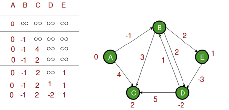
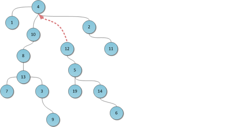

# lab7

Условия задач и описание решений

## [Задача 2. Железные дороги](./src/tasks/task2.rs)

*Ограничение по времени: 2 с. Ограничение по памяти: 256 мегабайт (Java, C# – 512 Mb, Python – 700 Mb)*

В стране X есть 𝑛 городов, которым присвоены номера от *1* до 𝑛. Столица страны имеет номер 𝑛. Между городами проложены железные дороги.

Однако дороги могут быть двух типов по ширине полотна. Любой поезд может ездить только по одному типу полотна. Условно один тип дорог помечают как 𝑅, а другой как 𝐵. То есть если маршрут от одного города до другого имеет как дороги типа 𝑅, так и дороги типа 𝐵, то ни один поезд по этому маршруту проехать не сможет. **От одного города до другого можно проехать только по маршруту, состоящему исключительно из дорог типа R или только из дорог типа B.**

Но это ещё не всё. По дорогам страны X можно двигаться только от города с меньшим номером к городу с большим номером. Это объясняет большой приток жителей в столицу, у которой номер 𝑛.

Карта железных дорог называется оптимальной, если не существует пары городов

𝐴 и 𝐵 такой, что от 𝐴 до 𝐵 можно добраться как по дорогам типа 𝑅, так и по дорогам типа 𝐵. Иными словами, для любой пары городов верно, что от города с меньшим номером до города с бОльшим номером можно добраться по дорогам только какого-то одного типа или же что маршрут построить вообще нельзя. Выясните, является ли данная вам карта оптимальной.

### Формат ввода

В первой строке дано число 𝑛 (1 ≤ 𝑛 ≤ 5000) — количество городов в стране. Далее задана карта железных дорог в следующем формате.

Карта задана *n-1* строкой. В *i*-й строке описаны дороги из города *i* в города *i+1, i+2, …, n*. В строке записано *n – i* символов, каждый из которых либо *R*, либо *B*. Если *j*-й символ строки *i* равен «B», то из города *i* в город *i + j* идет дорога типа «B». Аналогично для типа «R».

### Формат вывода

Выведите «YES», если карта оптимальна, и «NO» в противном случае.

| Ввод                        | Вывод |
| --------------------------- | ----- |
| 3<br>RB<br>R                | NO    |
| 4<br>BBB<br>RB<br>B         | YES   |
| 5<br>RRRB<br>BRR<br>BR<br>R | NO    |

### Описание решения

Будем составлять два массива `can_reach_r[i][j]` и `can_reach_b[i][j]`, показывающие, что из города i можно добраться дорогой R или B в город j. Первым делом заполним все прямые пути, не содержащие промежуточных городов, они будут совпадать с входными данными.

Потом для всех городов, между которыми находятся промежуточные города проверим, что если от начального города можно добраться до промежуточного `can_reach[from][intermediate]` и от промежуточного можно добраться до конечного `can_reach[intermediate][to]` одним типом дорог, то от начального можно добраться до конечного этим типом дорог `can_reach[from][to]`.

Если до города можно добраться обоими типами дорог, то карта не оптимальна `can_reach_r[from][to] & can_reach_b[from][to]`.

## [Задача 3. Зелье](./src/tasks/task3.rs)

*Ограничение по времени: 1 секунда. Ограничение по памяти: 256 мегабайт*

Злой маг Крокобобр варит зелье. У него есть большая колба, которую можно ставить на огонь и две колбы поменьше, которые огня не выдержат. В большой колбе налита компонента зелья, которую нужно подогреть на огне, маленькие колбы пусты. Емкость большой колбы магу Крокобобру известна — N миллилитров, маленьких — M и K миллитров. Смесь можно переливать из любой колбы в любую, если выполняется одно из условий: либо после переливания одна из колб становится пустой, либо одна из колб становится полной, частичные переливания недопустимы.

Требуется ровно L миллилитров смеси в большой колбе. Помогите Крокобобру определить, сколько переливаний он должен сделать для этого.

### Формат входных данных

N M K

`L, 1 ≤ N, M, K, L ≤ 2000`

### Формат выходных данных

Одно число, равное количеству необходимых переливаний или слово OOPS, если это невозможно.

### Описание решения

Будем решать перебором, есть 6 возможных вариантов: перелить из большой в первую, из большой во вторую, из первой во вторую, из второй в первую, из первой в большую, из второй в большую. Будем запоминать состояния и количество переливаний для их достижения в словаре hash_map, а сами переливания будем хранить в очереди queue.

Запустим цикл while очередь не пуста: достаем из очереди элемент, если содержимое большой колбы совпадает с необходимым, достаем из hash_map количество необходимых переливаний и возвращаем его. Приводим текущее состояние во все доступные и если они их еще нет в hash_map, то добавляем в него и очередь новое состояние.

Если очередь опустела и цикл закончился, возвращаем None, что значит нужно вывести OOPS.

## [Задача 5. Коврики](./src/tasks/task5.rs)

*Ограничение по времени: 2 секунды. Ограничение по памяти: 64 мегабайта*

Имеется прямоугольная область, состоящая из 6 ≤ N ≤ 1000 на 6 ≤ M ≤ 1000 одинаковых квадратных клеток. Часть клеток свободна, часть закрашена. Ковриком называется максимальное множество закрашенных клеток, имеющих общую граеицу. Коврики размером 1 х 1 тоже допустимы.

Требуется по заданной раскраске области определить количество находящихся на ней ковриков.

### Формат входных данных:

В первой строке содержатся N и M – размеры области. В каждой из следующих N строк находится ровно M символов, которые могут быть точкой, если поле свободно, или плюсом, если поле закрашено.

### Формат выходных данных:

Общее количество ковриков на поле.

### Примеры:

| Стандартный ввод                                                                                                                      | Стандартный вывод |
| ------------------------------------------------------------------------------------------------------------------------------------- | ----------------- |
| 6 6<br>.++++.<br>…..+<br>+..+..<br>..++..<br>.+….<br>.+...+                                                                           | 6                 |
| 10 10<br>.++..++.++<br>+.+….+++<br>……..++<br>+….++…<br>+++.+++.++<br>…..+.+..<br>+.+.++++++<br>+.++.++..+<br>++++...++.<br>+...+..+.. | 10                |
| 5 5<br>..+..<br>.+++.<br>.+..+.<br>+.+.+<br>+++++                                                                                     | 2                 |

### Описание решения

Пройдемся по всем клеткам, запустив два цикла for, один из которых вложенный. Попутно будем вести таблицу посещенных клеток visited[i][j]. Для каждой клетки проверяем: если она ковёр Rug и мы ее не посещали, увеличиваем счетчик ковров, указываем клетку посещенной, а так же находим всех 4-х соседей этой клетки, являющихся коврами Rug, и соседей их соседей и помечаем их посещенными.

## [Задача 7. Кратчайшие пути](./src/tasks/task7.rs)

*Ограничение по времени: 2 секунды. Ограничение по памяти: 64 мегабайта*

Взвешенный граф с N вершинами задан своими M ребрами Ei, возможно отрицательного веса. Требуется найти все кратчайшие пути от вершины S до остальных вершин. Если граф содержит отрицательные циклы, вывести IMPOSSIBLE. Если от вершины S до какой-либо из вершин нет маршрута, то в качестве длины маршрута вывести слово UNREACHABLE.

Вершины графа нумеруются, начиная с нуля. 3 ≤ N ≤ 800

1 ≤ M ≤ 30000

-1000 ≤ Wi ≤ 1000

### Формат входных данных:

```
N M S
S1 E1 W1
S2 E2 W2
...
```

### Формат выходных данных:

`IMPOSSIBLE` или `D1 D2 D3 … DN`, где Di может быть `UNREACHABLE`

### Пример

| стандартный ввод                                              | стандартный вывод     |
| ------------------------------------------------------------- | --------------------- |
| 4 5 0<br>0 1 100<br>1 2 100<br>2 0 -100<br>0 2 1000<br>3 1 15 | 0 100 200 UNREACHABLE |
| 3 3 0<br>0 1 5<br>1 2 8<br>2 0 -20                            | IMPOSSIBLE            |

### Описание решения

Инициализируем все расстояния как `unreachable`, а расстояние до `start` как `0` в массиве `dist`.

Теперь повторим проход по всем ребрам `v-1` раз, где `v` количество вершин: для каждого ребра `(u, v)`, если `dist[v] > dist[u] + вес ребра`, то обновляем его расстояние как `dist[v] = dist[u] + вес ребра`. После окончания будут сформированы кратчайшие расстояния до каждой вершины.

Чтобы проверить наличие отрицательных циклов в графе надо сделать еще один проход по всем ребрам, проверяя то же условие, но, если поменяется вес хотя бы одного ребра, значит в графе присутствует отрицательный цикл.



## [Задача 10. План электрификации](./src/tasks/task10.rs)

*Ограничение по времени: 1 секунда. Ограничение по памяти: 64 мегабайта*

В некоторой стране n городов. Правительство решило электрифицировать все эти города. Для начала в k различных городах были построены электростанции. Другие города должны быть связаны с электростанциями линиями электропередач. Между любой парой городов i и j можно построить линию электропередач стоимостью cij рублей. После гражданской войны страна находится в глубоком кризисе, поэтому правительство решило построить всего лишь несколько линий электропередач. Конечно, после постройки линий должен существовать путь по ним от любого города до некоторого города с электростанцией. Найдите минимальную возможную стоимость постройки всех необходимых для этого линий электропередач.

### Формат входных данных

В первой строке записаны целые числа *n* и *k* (1 ≤ *k* ≤ *n* ≤ 100). Во второй строке записаны *k* различных целых чисел — номера городов с электростанциями. В следующих *n* строках записана таблица {*cij*} размера *n* × *n*, состоящая из целых чисел (0

≤ *cij* ≤ 105). Гарантируется, что *cij* = *cji*, *cij* > 0 для *i* ≠ *j*, *cii* = 0.

### Формат выходных данных

Выведите минимальную стоимость электрификации всех городов.

### Примеры

| стандартный ввод                                       | стандартный вывод |
| ------------------------------------------------------ | ----------------- |
| 4 2<br>1 4<br>0 2 4 3<br>2 0 5 2<br>4 5 0 1<br>3 2 1 0 | 3                 |

### Описание решения

Используем [систему непересекающихся множеств dsu](./src/modules/disjoint_set_union.rs), чтобы отслеживать группы соединенных городов. Она имеет три операции `make_set` для создания множества из одного элемента, `find` для нахождения идентификатора множества, `unite` для объединения множеств. Для обозначения множеств выбирается один из их элементов как идентификатор. Я использую словарь, но можно и массив, если хранить нужно только числа.

Изначально все города находятся в своих единичных множествах. Запишем все ребра в список и отсортируем его по минимальному весу ребра. Заведем массив `connected[i] = true или false`, где i будет обозначать номер города. Города с электростанциями запишем как true и добавим в dsu.

Запустим for по ребрам: будем брать ребро в том случае, если его города еще не подключены `connected[i] & connected[j] == false`. Когда берем ребро, мы находим города в dsu и объединяем их в одно множество, и указываем, что между они уже подключены `connected[i] = true`.



## Автотесты

```
cd lab7
cargo test
```

Можно запустить:

* `task2`
* `task3`
* `task5`
* `task7`
* `task10`

## [Бенчмарки](./benches/benchmarks.rs)

```
cd lab7
cargo bench
```

Можно запустить:

* `task2`